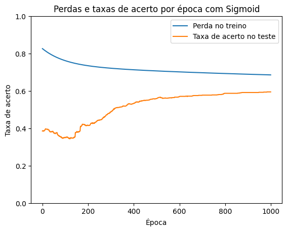
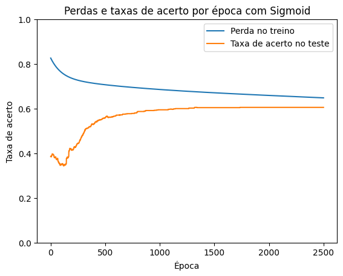
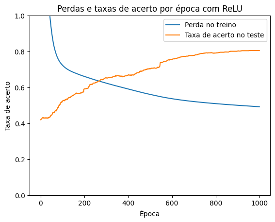
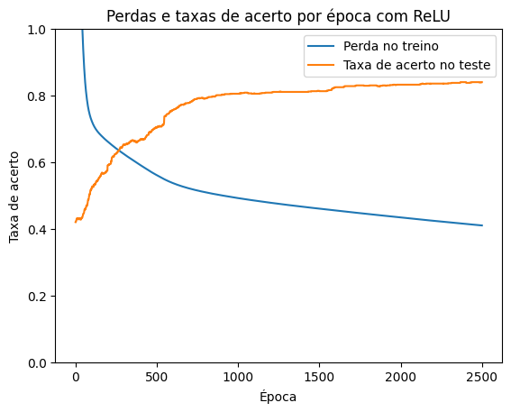

# Spam Email Classification Using Neural Networks

This project applies neural networks to classify emails as spam or not spam using the UCI Spambase dataset. The project includes the implementation and evaluation of models with different activation functions, specifically ReLU and sigmoid, to determine their effectiveness in solving this problem.

## Table of Contents
- [Introduction](#introduction)
- [Problem Description](#problem-description)
  - [Artificial Intelligence](#artificial-intelligence)
  - [Neural Networks](#neural-networks)
- [Model Implementation](#model-implementation)
  - [Differences in Code Between ReLU and Sigmoid](#differences-in-code-between-relu-and-sigmoid)
    - [ReLU](#relu)
    - [Sigmoid](#sigmoid)
- [Results](#results)
  - [Results with Sigmoid Activation Function](#results-with-sigmoid-activation-function)
  - [Results with ReLU Activation Function](#results-with-relu-activation-function)
- [Conclusion](#conclusion)

## Introduction

The classification of emails as spam or not spam is a relevant problem today, given the large volume of unwanted emails. This project aims to implement and evaluate a neural network model capable of performing this task with high accuracy using the UCI Spambase dataset (ID 94).

## Problem Description

The problem addressed is the classification of emails using the UCI Spambase dataset, which contains various features extracted from emails used to train the neural network model.

### Artificial Intelligence

Artificial Intelligence (AI) has been applied in various domains, including text classification and spam detection, using techniques ranging from supervised learning algorithms to deep neural networks.

### Neural Networks

Neural networks are computational models inspired by the human brain, capable of learning complex patterns from data. They have proven to be particularly effective in classification and pattern recognition tasks.

## Model Implementation

A multi-layer neural network model was implemented using the TensorFlow library in Python. The model was trained with two different activation functions: ReLU and sigmoid. The primary difference between the models lies in the activation function used in the hidden layers.

### Differences in Code Between ReLU and Sigmoid

The difference between the ReLU and sigmoid models is primarily in the activation function applied in the hidden layers.

#### ReLU

The ReLU (Rectified Linear Unit) activation function is defined as:


ReLU is known for its simplicity and efficiency, particularly in deep learning models. It helps mitigate the vanishing gradient problem and speeds up training.

In the ReLU model, activation was done as follows:

```python
train1 = tf.nn.relu(neuron(X_train, weights1, bias1))
train2 = tf.nn.relu(neuron(train1, weights2, bias2))
```

#### Sigmoid

The sigmoid activation function is defined as:


Sigmoid maps the input to a value between 0 and 1, making it useful for binary classification. However, it can suffer from the vanishing gradient problem, particularly in deep networks.

In the sigmoid model, activation was done as follows:

```python
train1 = tf.sigmoid(neuron(X_train, weights1, bias1))
train2 = tf.sigmoid(neuron(train1, weights2, bias2))
```

Other details of the code, including weight and bias initialization, loss function, optimizer, and training loop, remain the same for both implementations.

## Results

The results show that the ReLU activation function achieved a better accuracy rate compared to the sigmoid function, as observed in the loss and accuracy graphs per epoch.

### Results with Sigmoid Activation Function

The sigmoid activation function struggled to surpass the loss rate, as seen in the loss and accuracy graphs per epoch. Even with an increase in the number of training epochs, the accuracy rate never significantly outperformed the loss rate.

#### Sigmoid - 1000 epochs

#### Sigmoid - 2500 epochs


### Results with ReLU Activation Function

In comparison, the ReLU activation function achieved a better accuracy rate, maintaining a high accuracy of 0.84 with a cost of 0.41, with 1 as the maximum comparative result.

#### ReLU - 1000 epochs

#### ReLU - 2500 epochs


## Conclusion

The implemented neural network proved to be effective in classifying emails as spam or not spam. The ReLU activation function provided better results in terms of accuracy, achieving 84\% compared to 60.5\% with the sigmoid function. These results are consistent with the literature, which indicates that the ReLU function is more suitable for most classification problems.
